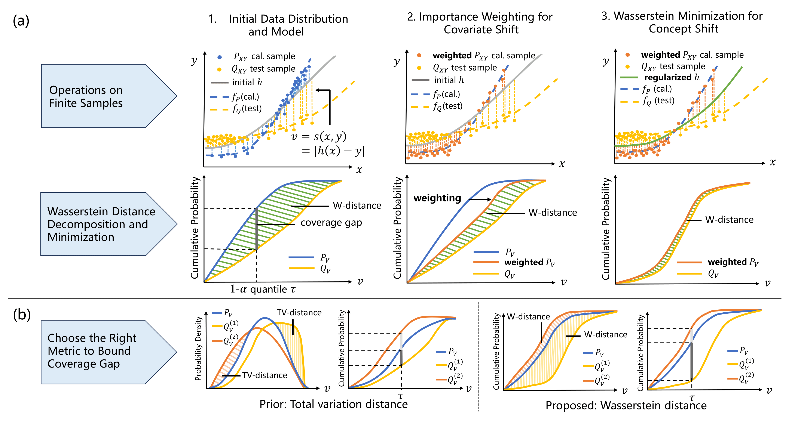

# Wasserstein-regularized Conformal Prediction
This is the source code for the paper [Wasserstein-Regularized Conformal Prediction under General Distribution Shift](iclr.cc/virtual/2025/poster/29180).

**(a)** Joint distribution shift can include both covariate shift ($P_X\neq Q_X$) and concept shift ($f_P\neq f_Q$). Coverage gap is the absolute difference in cumulative probabilities of calibration and test conformal scores at the empirical $1-\alpha$ quantile $\tau$. We first address covariate-shift-induced Wasserstein distance by applying importance weighting to calibration samples, and further minimize concept-shift-induced Wasserstein distance for accurate and efficient prediction sets;

**(b)** $Q_V^{(1)}$ and $Q_V^{(2)}$ are two distinct test conformal score distributions. Wasserstein distance integrates the vertical gap between two cumulative probability distributions overall *all* quantiles, and is sensitive to coverage gap changes at *any* quantile. Total variation distance fails to indicate coverage gap changes thoroughly as it is agnostic about where two distributions diverge.

## Data 
The `data` folder contains the datasets. The codes in `data_prepare/data_name.py` process the raw datasets in the `data/name/raw` folders and output the sampled training, calibration, and test sets in the `data/name/processed` folders.

## Experiment results and source codes correspondence
The table below presents the correspondence between experiment results and source codes.
Section | Presentation | Folder | Experiment codes | Plot/Table codes
--- | :------ | :---:  | :---:|:---:
Sec 6.2| Table 1 |`correlation`|`distance_correlation.py`|`table_correlation_result.py`
Sec 6.3|Figure 3 |`main`|`WRCP_main.py`|`plot_W_distance_min.py`
Sec 6.4|Figure 4,11-18|`main`|`WRCP_main.py`, `CQR_main.py`|`plot_main_result.py`
Sec 6.5|Figure 5|`main`|`WRCP_main.py`|`plot_ablation.py`
Appendix B.1|Figure 6|`hybrid`|`WRWC_hybrid.py`|`plot_hybrid_result.py`
Appendix B.2|Figure 7|`guaranteed`|`WCCP_with_WRCP_guarantee.py`, `WRCP_guaranteed.py`|`plot_guaranteed_result.py`
Appendix D.3|Figure 10|`unweighted`|`WRCP_unweighted.py`|`plot_unweighted_result.py`
